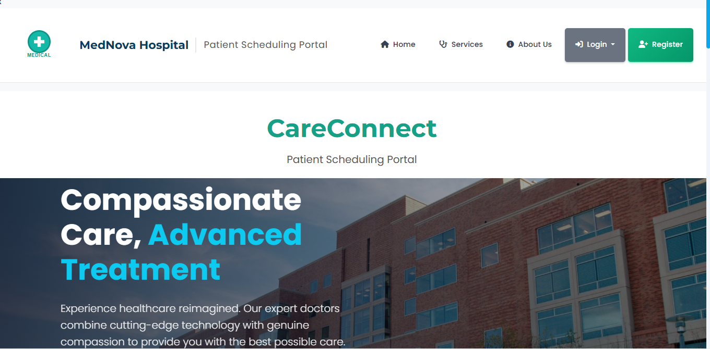
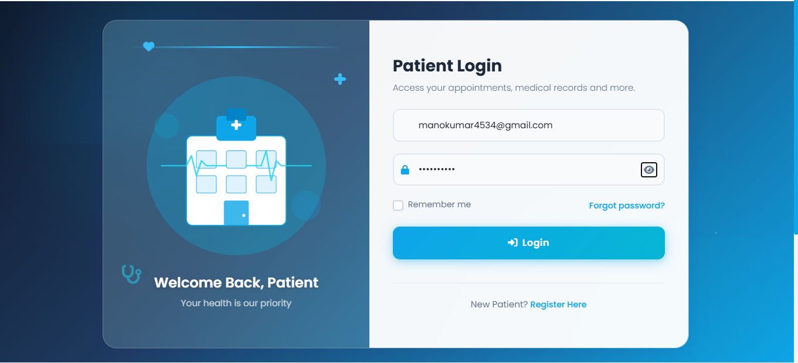
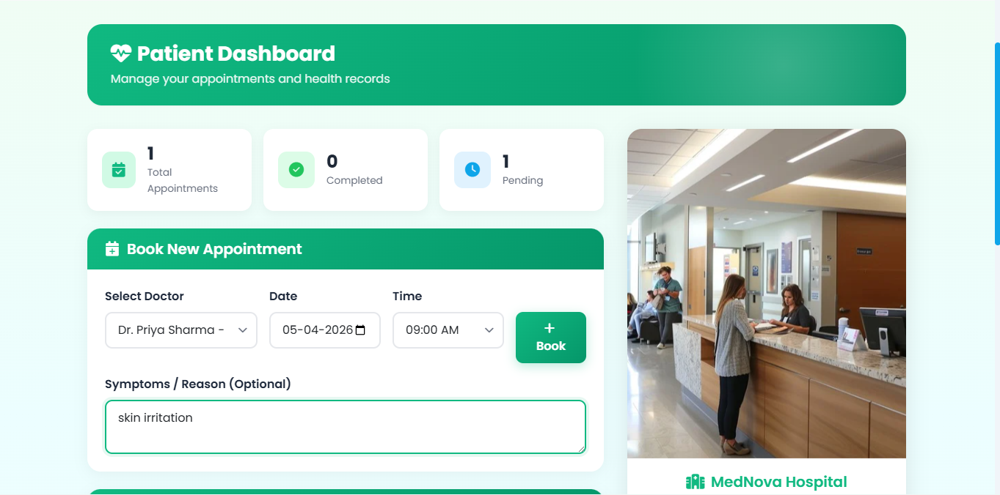
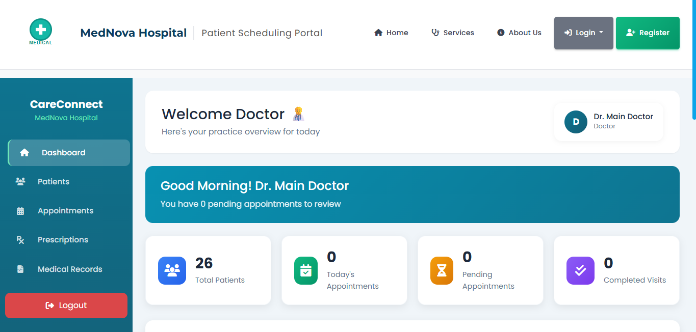
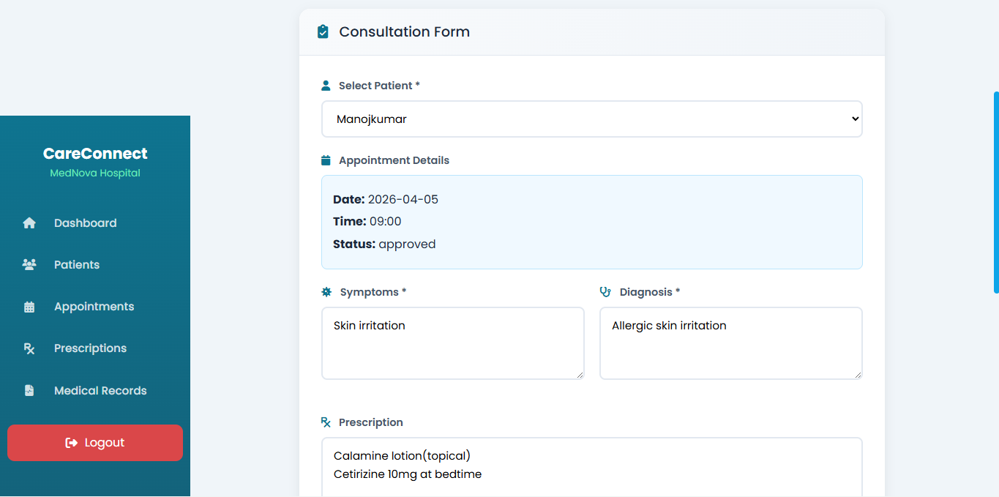

# CareConnect – Patient Scheduling Portal

CareConnect is a hospital patient scheduling and doctor consultation system developed using Flask and SQLite.  
This project helps patients book appointments with doctors and allows doctors to manage consultations, diagnosis, prescriptions, and patient records.

---

## 📌 Features

- Patient Registration and Login
- Doctor Login
- Book Doctor Appointments
- Appointment Approval System
- Patient Dashboard
- Doctor Dashboard
- Consultation Form
- Symptoms and Diagnosis Entry
- Prescription Management
- Notes and Follow-up Details

---

## 🛠️ Technologies Used

- Python
- Flask
- SQLite
- HTML
- CSS
- JavaScript

---

## 📂 Project Structure

- `app.py` – Main Flask application
- `models.py` – Database models
- `config.py` – Configuration file
- `requirements.txt` – Required Python packages
- HTML pages for frontend
- `script.js` – Frontend JavaScript
- `database.db` / `hospital.db` – Database files

---

## ▶️ How to Run the Project

1. Clone the repository
2. Open the project folder
3. Install required packages:

```bash
pip install -r requirements.txt
```

4. Run the Flask app:

```bash
python app.py
```

5. Open browser:

```bash
http://127.0.0.1:5000
```

---

## 📸 Project Screenshots

### Home Page


### Patient Login


### Patient Dashboard


### Book Appointment Status


### Doctor Dashboard


### Consultation Page


---

## 🚀 Future Enhancements

- Online payment integration
- Email/SMS appointment reminders
- Video consultation support
- Admin panel
- Medical history tracking

---

## 👨‍💻 Developed By

**Sanjay P**
